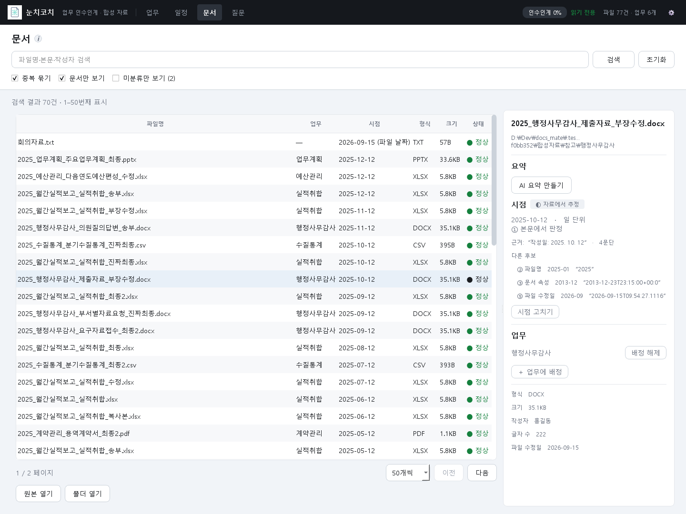
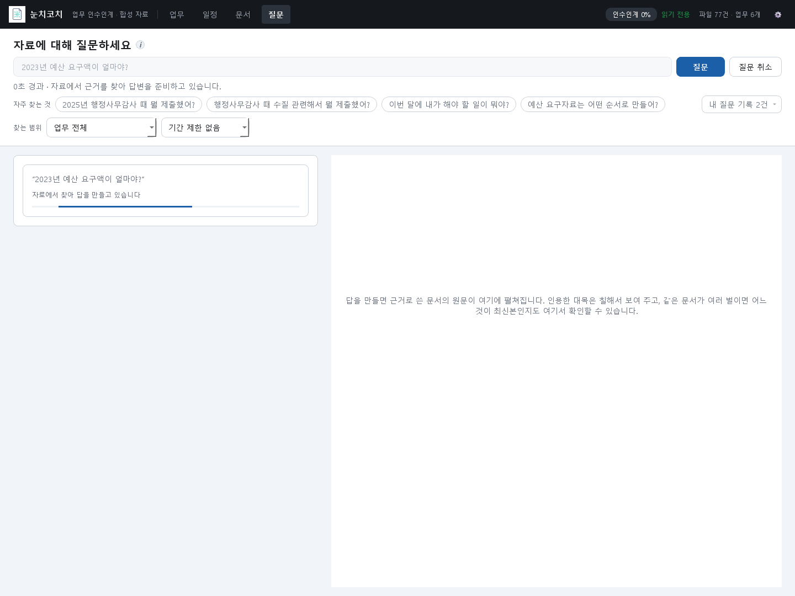
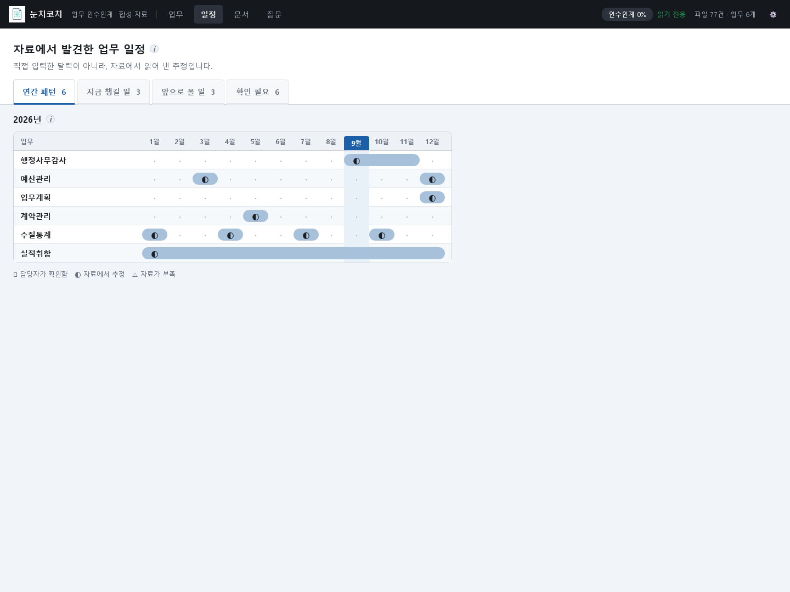
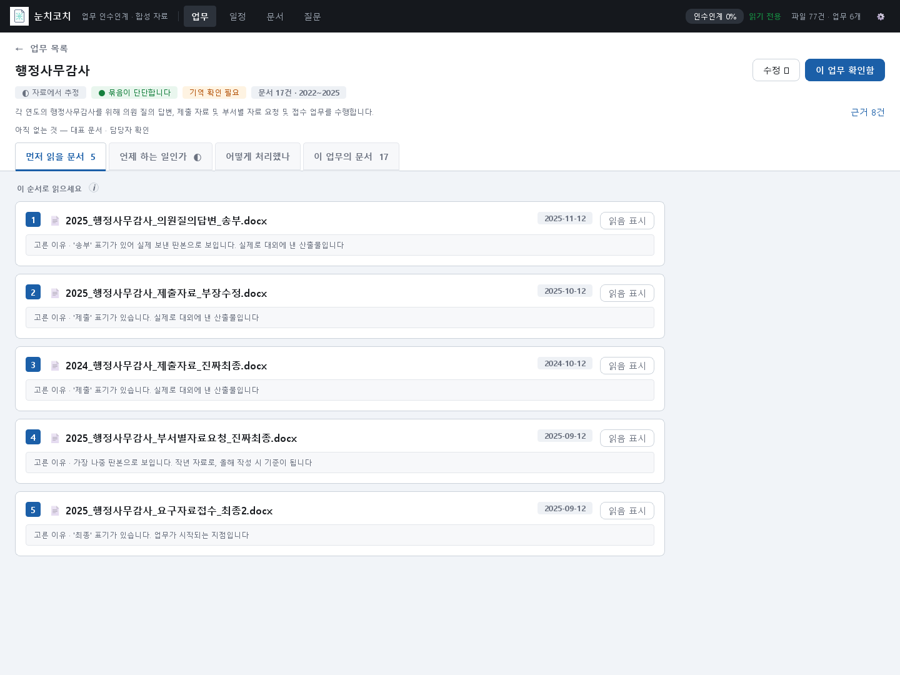
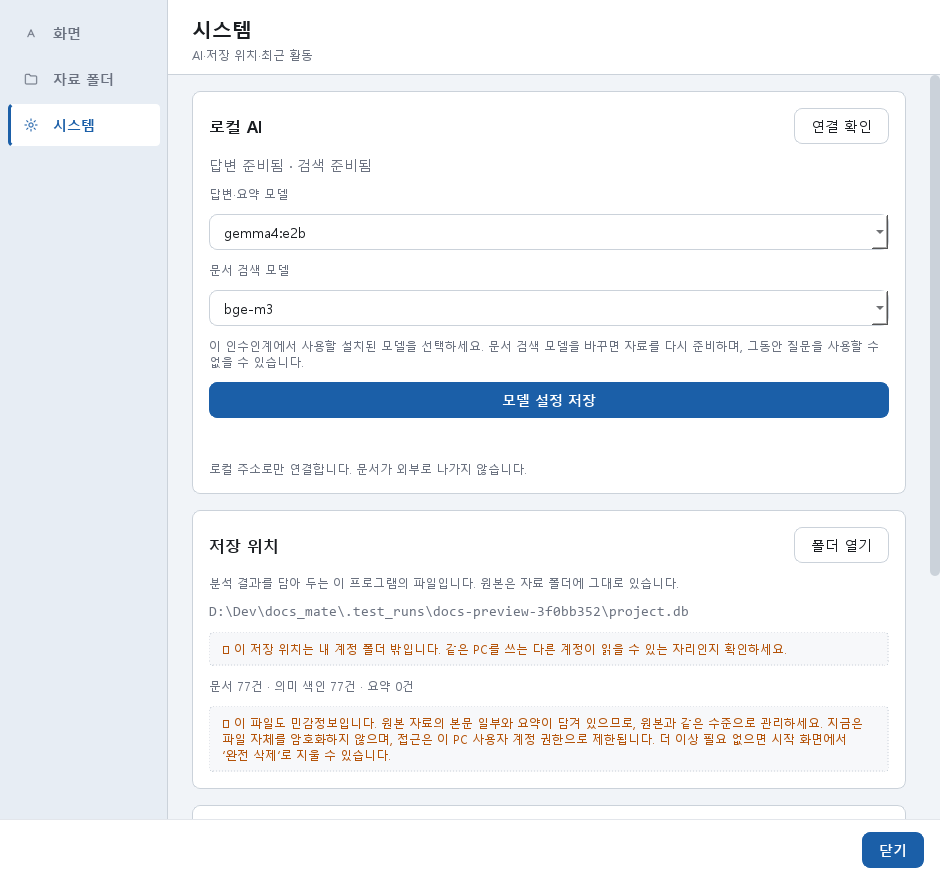
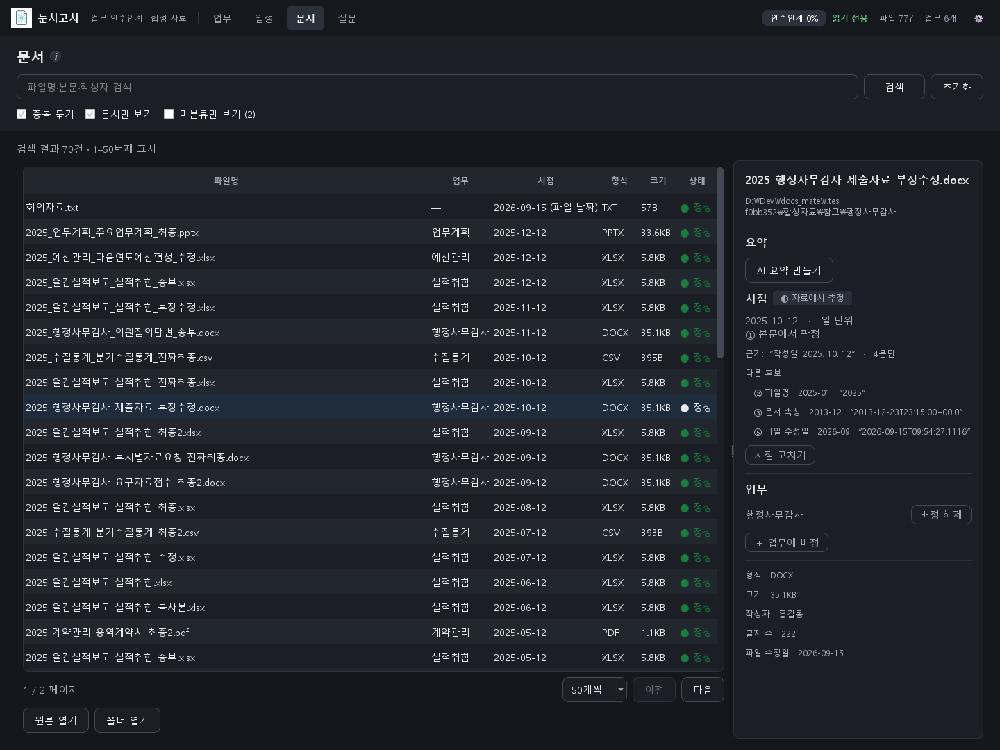
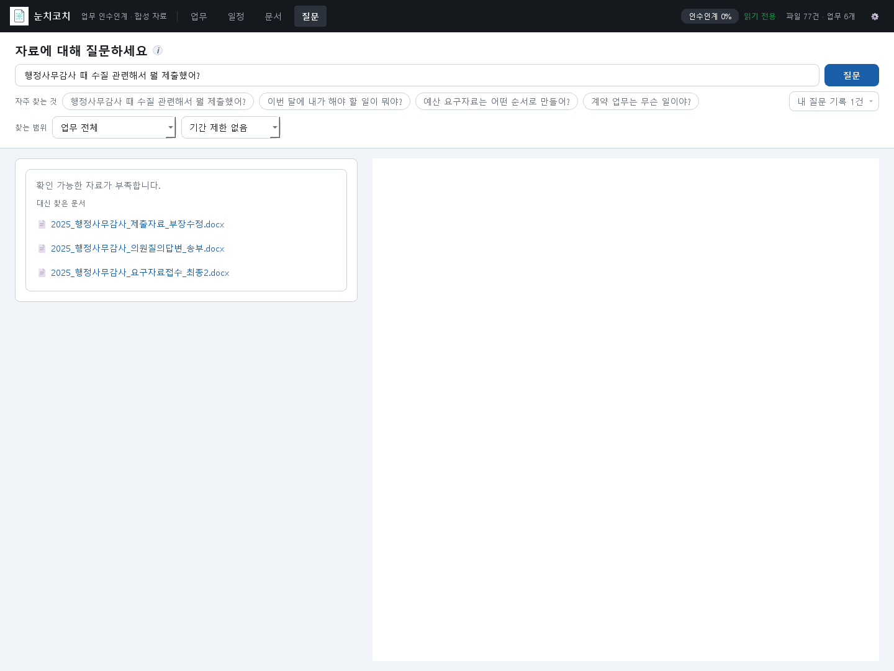

# 눈치코치 (NunchiCoach)

전임자가 남긴 자료에서 **무슨 업무를 맡았고, 언제 해야 하며, 지난번에는 어떻게 처리했는지**를 근거 문서와 함께 확인하는 Windows용 로컬 인수인계 도구입니다.

원본 파일은 읽기 전용으로 다루고, 분석 결과와 사용자 교정은 프로젝트에 저장합니다. AI가 추정한 내용과 사용자가 확인한 내용을 구분하며, 근거가 부족한 질문에는 답변을 유보합니다.


*2026-09-15 현재 소스의 실제 앱 화면입니다. 합성 문서 77개를 분석한 예시이며, 실제 기관 자료나 사용자 확인 완료 상태를 뜻하지 않습니다.*

[시작하기](#시작하기) · [최신 화면](#최신-화면) · [검증 현황](#검증-현황) · [전체 문서](doc/README.md)

## 핵심 기능

| 메뉴 | 할 수 있는 일 |
|---|---|
| **업무** | 업무 후보와 근거 확인, 먼저 읽을 문서, 업무 확인·수정·병합·분리, 연도별 처리 순서·비교, 인수인계 진행도, Markdown 보고서 내보내기 |
| **일정** | 자료에서 발견한 업무 주기와 연간 패턴 확인, 이번 달 확인할 업무에서 상세 근거로 이동 |
| **문서** | 파일명·경로·본문·작성자 검색, 중복·미분류 확인, 페이지 탐색, 본문·시점·분류 교정, 원본 열기 |
| **질문** | 업무·연도 범위 지정, 키워드와 의미 검색, 문장별 인용과 원문 미리보기, 답변 유보, 질문 기록·피드백·명시적 후속 질문 |

- **문서 탐색:** 50·100·200건씩 표시하며 전체 결과 수와 현재 범위를 안내합니다. 500건 이후의 문서도 탐색하고 상세 영역의 폭을 조절할 수 있습니다.
- **AI 설정:** 설정 → 시스템에서 생성·검색 모델을 프로젝트별로 선택합니다. 연결 확인은 화면 조작을 막지 않습니다.
- **질문 대기:** 경과 시간을 확인하고 취소할 수 있습니다. 취소된 답변이 뒤늦게 표시되거나 기록되지 않도록 처리합니다.
- **자료 갱신:** 원본이 바뀌면 자동 분석을 다시 만들고, 사용자가 확정한 날짜와 업무 연결은 보존합니다. 사라졌다 돌아온 파일의 상태도 복원합니다.
- **로컬 실행:** 앱·Ollama·모델 설치 후 인터넷 없이 사용합니다. AI 요청은 로컬 주소로만 연결하며 환경 프록시와 리다이렉트를 사용하지 않습니다.

## 최신 화면

현재 화면은 상단의 **업무·일정·문서·질문** 4개 메뉴를 사용합니다. 아래 이미지는 화면을 새로 그린 시안이 아니라 현재 Qt 위젯을 촬영한 결과입니다.

### 문서 탐색

검색 결과와 페이지 범위를 확인하고, 선택한 문서의 시점·업무·원문을 함께 살펴봅니다. 예시의 원본 77건은 중복 묶기 적용 후 70건으로 표시됩니다.



### 질문 대기와 결과 확인

질문은 한 번씩 독립적으로 처리합니다. 출처 번호를 눌러 근거를 확인하고, 자료가 부족하면 답변 대신 관련 문서를 보여줍니다.



[실제 질문 결과 화면](doc/screenshots/ask.png)은 이번 촬영에서 앱이 답변을 유보한 상태입니다. 소개용 답변을 따로 넣지 않았으며, 아래 검증 현황에 후속 점검 항목을 기록했습니다.

### 일정

업무 주기는 문서에서 추정한 결과입니다. 업무와 근거를 확인한 뒤 사용자 확인 상태로 관리합니다.



<details>
<summary>업무 상세·설정·어두운 테마·대기 및 유보 화면 더 보기</summary>

#### 업무 상세



#### 모델 설정



#### 어두운 테마



#### 질문 대기와 취소


#### 답변을 유보한 경우



</details>

[촬영 조건과 이미지 목록](doc/screenshots/README.md)

## 시작하기

### 실행 환경

- Windows 10/11 64-bit 대상입니다. 기관별 OS·보안 환경은 파일럿에서 확인해야 합니다.
- 소스 실행·빌드는 **Python 3.14** 기준이며 직전 검증 버전은 **3.14.6**입니다. 패키지 실행 파일에는 Python 설치가 필요 없습니다.
- AI 기능에는 로컬 Ollama와 모델이 필요합니다. 기본 생성 모델은 `gemma4:e2b`, 검색 모델은 `bge-m3`이며 설정에서 변경할 수 있습니다.
- AI가 없어도 문서 조사·본문 추출·기본 검색을 사용할 수 있습니다. 모델 품질·속도·메모리는 장비와 자료에 따라 다르며 8GB PC 검증은 남아 있습니다.

### 배포 폴더로 실행

배포본의 **`NunchiCoach` 폴더 전체**를 유지하고 `NunchiCoach.exe`를 실행합니다. 실행 파일만 복사하면 필요한 구성 파일이 빠집니다. Ollama와 모델은 별도로 준비합니다.

이 작업 공간에서 만든 검증용 배포본은 `dist/review-20260915-final/NunchiCoach/`입니다. Git 저장소에 포함된 다운로드 파일은 아니며, 다른 PC에서는 아래 빌드 절차나 별도로 전달받은 배포 폴더를 사용합니다.

### 소스로 실행

Windows 명령 프롬프트(cmd)에서 저장소 폴더로 이동한 뒤 실행합니다.

```cmd
start.bat
```

첫 실행에 가상환경을 만들고 `requirements.lock`의 버전으로 설치합니다. 수동 실행은 다음과 같습니다.

```cmd
py -3.14 -m venv .venv
.venv\Scripts\python.exe -m pip install -r requirements.lock
.venv\Scripts\python.exe -m app.main
```

시작 화면에서 인수인계를 만들거나 선택한 뒤 자료 폴더를 연결합니다. 프로젝트 목록은 기본적으로 `%LOCALAPPDATA%\NunchiCoach\projects\registry.json`에 저장됩니다. 개발용으로 특정 프로젝트를 바로 열려면 `--project default`를 사용합니다.

**기존 프로젝트의 첫 업그레이드와 검색 모델 변경 시에는 재분석 시간이 필요할 수 있습니다.** 사용자 확정 날짜·업무 연결은 보존합니다.

### 오프라인 설치

인터넷 사용이 허용된 동일한 Windows/Python 환경에서 패키지와 승인 모델을 미리 준비합니다.

```cmd
.venv\Scripts\python.exe -m pip download -r requirements.lock -d wheelhouse
```

`start.bat`은 저장소 옆 `wheelhouse`가 있으면 인터넷 없이 설치합니다. 다른 경로는 다음처럼 지정합니다.

```cmd
set NUNCHICOACH_OFFLINE=1
set NUNCHICOACH_WHEELHOUSE=D:\offline-packages\wheelhouse
start.bat
```

오프라인 모드에서는 패키지 폴더가 없을 때 인터넷 설치로 넘어가지 않습니다. Ollama 실행 파일과 모델도 별도로 반입해야 하며, 깨끗한 오프라인 PC의 전체 설치 검증은 후속 항목입니다.

## 지원 형식과 한계

| 형식 | 범위 |
|---|---|
| DOCX·PPTX·XLSX/XLSM | 문서·슬라이드·시트의 본문 추출 |
| PDF | 텍스트 레이어 추출. 스캔본 OCR 제외 |
| HWPX | XML 본문 추출 |
| HWP 5.0 | 본문 파서 구현. 표 구조 보존 제한, 실제 HWP 회귀 표본 검증 필요 |
| TXT·CSV·MD·LOG | 텍스트 추출 |
| 구형 DOC·XLS·PPT·HWP 3.0 | 미지원 안내 |

이미지 OCR과 이메일 추출은 후속 범위입니다. 부분 추출·실패·잠김·크기 초과는 문서 상태에 표시합니다. 보고서는 **Markdown**으로 내보내며 DOCX·PDF 출력은 아직 제공하지 않습니다.

## 검증 현황

2026-09-15 코드 보완 후 실행 기록입니다. 이번 문서·화면 현행화에서 새로 측정한 일반 테스트 수치가 아닙니다.

| 검사 | 결과 |
|---|---|
| 전체 회귀 | **902 통과, 4 건너뜀, 경고 1** |
| 실제 AI 포함 별도 검사 | **36 통과**. 실제 모델 호출 검사 3개 포함 |
| 배포본 자체 점검 | 필수 리소스 포함 확인, **합성 문서 77개 정상 추출** |

건너뜀 4개는 선택형 실제 AI 검사 3개와 외부 실문서 검사 1개입니다. 실제 AI 3개는 별도 실행에서 통과했습니다. 경고는 기존 테스트의 오래된 Qt 마우스 이벤트 호출입니다. 실제 기관 정확도·실제 HWP·8GB 장비 성능·원격 CI 통과를 뜻하지 않습니다.

**화면 촬영 중 추가 관찰:** 새 합성 프로젝트에서 기존 평가셋의 답변 대상 질문 두 개도 유보됐습니다. 일반 테스트 통과와 실제 질문 품질을 구분하고, 이 사례의 검색·생성·검증 단계 점검을 후속 항목으로 남겼습니다. [상세 관찰](doc/01_현재구현_및_검증현황.md#6-문서-현행화-중-추가-관찰)

[결과 보고와 실행 기록](doc/보완작업_결과보고_2026-09-15.md) · [구현 상태표](doc/01_현재구현_및_검증현황.md) · [후속 검증 계획](doc/파일럿_및_배포_검증계획.md)

### 테스트 실행

아래 예시는 저장소 루트의 Windows 명령 프롬프트(cmd) 기준입니다.

```cmd
.venv\Scripts\python.exe -m app.tools.make_fixtures
.venv\Scripts\python.exe -m pytest

rem 로컬 Ollama와 모델을 준비한 뒤 별도 실행
set NUNCHICOACH_LIVE_AI=1
.venv\Scripts\python.exe -m pytest tests/test_ai.py tests/test_chunks_pipeline.py
set NUNCHICOACH_LIVE_AI=
```

임시 파일과 캐시는 `.test_runs`에 둡니다. GitHub Actions와 GitLab 검증 설정이 있으며, GitLab에는 `windows` 태그와 Python 3.14가 있는 Runner가 필요합니다. 원격 실행 결과는 아직 확인하지 않았습니다.

### 빌드와 구성요소 목록

```cmd
.venv\Scripts\python.exe -m app.tools.lockfile --check
.venv\Scripts\python.exe -m PyInstaller NunchiCoach.spec
dist\NunchiCoach\NunchiCoach.exe selftest tests\fixtures\sample_tree
.venv\Scripts\python.exe -m app.tools.sbom --pretty
```

자체 점검은 필수 리소스가 없거나 정상·부분 추출 이외의 파싱 상태가 있으면 실패합니다. SBOM은 설치된 구성요소 목록이며 기관 반입 승인이나 프로젝트 공개 라이선스를 대신하지 않습니다.

### 품질 계측

해당 프로젝트에 자료를 분석한 뒤 평가합니다. 기본 RAG 평가셋은 합성 자료용이므로 실제 자료에는 별도의 정답셋이 필요합니다.

```cmd
.venv\Scripts\python.exe -m app.tools.rag_report --project default --repeat 3
.venv\Scripts\python.exe -m app.tools.cluster_report --project default --truth 정답.csv

set NUNCHICOACH_SAMPLES=D:\검증표본
.venv\Scripts\python.exe -m app.tools.parse_bench --record
.venv\Scripts\python.exe -m app.tools.parse_bench --check
```

`--record`는 기준을 새로 씁니다. 의도한 변경인지 확인한 뒤에만 갱신하고, 비교에는 `--check`를 사용합니다.

## 저장 데이터와 진단

- 프로젝트 DB에는 추출 본문·분석·질문 기록 등 업무 정보가 저장되며 **현재 파일 자체를 암호화하지 않습니다**. 프로젝트 저장 위치와 Windows 접근 권한을 관리해야 합니다.
- `logs/diagnostic.log`는 오류 종류와 코드 위치 등 제한된 항목을 기록하고 회전 보관합니다. 본문·질문·답변·원본 경로·예외 메시지를 진단 로그에 넣지 않습니다.
- 감사 기록은 진단 로그와 별개이며 설정 화면에서 확인·내보낼 수 있습니다.
- 정기 백업·복원, 민감정보 정책, 서명·기관 반입, 공개 라이선스는 [후속 검증 계획](doc/파일럿_및_배포_검증계획.md)에 남아 있습니다.

## 프로젝트 구조

```text
app/
  main.py       앱 진입점
  ui/           화면·테마·공통 위젯·로고
  ingest/       스캔·해시·문서 파서
  core/         시점·업무·주기·처리 순서·보고서·진단
  search/       문서 목록 검색·조각 검색·근거 검증
  ai/           로컬 모델 연결·설정·프롬프트
  db/           데이터 저장·마이그레이션·프로젝트 관리
  jobs/         분석·질문·예열·상태 확인 작업
  tools/        합성 표본·품질 측정·잠금·SBOM
doc/            제품 기준·PRD·계획·결과·최신 화면
tests/          단위·통합·UI 회귀 검사
requirements.txt    의존성 선언
requirements.lock   검증 환경의 버전 잠금
start.bat           Windows 소스 실행
NunchiCoach.spec     실행 파일 패키징
```

## 문서

- [전체 문서 안내](doc/README.md)
- [제품 정체성과 MVP 메뉴 체계](doc/00_제품_정체성_및_MVP_메뉴체계.md)
- [현재 구현 및 검증 현황](doc/01_현재구현_및_검증현황.md)
- [요구사항과 합격 기준(PRD)](doc/업무_인수인계_지식화_시스템_PRD.md)
- [UI/UX 개선 계획](doc/UI_UX_개선계획_2026-09-15.md)
- [질문 화면 RAG 설계·실험 기록](doc/질문화면_RAG_개선계획.md)

초기 기획·과거 분석은 이력으로 보존하고 현재 적용 상태를 각 문서 첫 부분에 표시했습니다.
