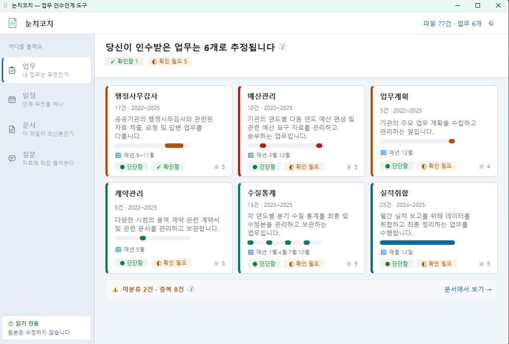

# 눈치코치 (NunchiCoach) 🧠📄

> **전임자가 남긴 안개 같은 자료 더미에서, 후임자가 "무슨 업무를 맡았고(What) · 언제 해야 하며(When) · 지난번엔 어떻게 처리했는지(How)"를 근거 문서와 함께 손쉽게 파악할 수 있도록 돕는 완전 로컬 인수인계 지능화 시스템**

---


## 📌 프로젝트 개요

발령 첫날 전임자의 폴더를 인수받은 후임자는 보통 다음과 같은 3가지 핵심 질문에 부딪힙니다:
1. **What**: 내가 맡은 업무가 무엇인가?
2. **When**: 그 업무는 언제 해야 하는가?
3. **How**: 지난번에는 어떤 순서로 처리했는가?

**눈치코치(NunchiCoach)**는 전임자에게 반복해서 물어봐야 알 수 있던 이 세 가지 질문에 **전임자 없이 오직 남겨진 자료만으로 답할 수 있도록 지원**합니다.

* **로컬 동작**: 앱과 Ollama 모델 설치가 끝나면 인터넷 없이 사용합니다. AI 요청은 환경 프록시를 사용하지 않고 로컬 주소로만 연결합니다. 오프라인 설치에는 실행 파일 또는 미리 준비한 패키지·모델이 필요합니다.
* **원본 문서 100% 안전 보존**: 원본 파일을 절대로 수정·이동·삭제하지 않으며, 오직 읽기 전용으로 안전하게 인제스트합니다.
* **근거 기반 AI 지원**: 모든 AI 분석 및 답변은 1클릭으로 원본 문서의 위치와 문맥을 확인할 수 있는 근거 링크를 제공합니다.

---

## ✨ 핵심 기능

눈치코치는 후임자의 직관적인 업무 파악을 위해 **4대 핵심 메뉴 체계**를 제공합니다.

```
┌─────────────────────────────────────────────────────────────┐
│ 눈치코치                [ 8,420 / 12,438 분석 중 · 12분 ]  ⚙ │
├──────────┬──────────────────────────────────────────────────┤
│ 🗂 업무   │  • 업무 목록 및 자동 추정 카드                     │
│ 📅 일정   │  • 업무 주기(When) & 처리 순서(How) 타임라인       │
│ 📄 문서   │  • 원본 보관소, 검증 & 미분류 문서 관리            │
│ 💬 질문   │  • 로컬 LLM (Ollama) RAG 기반 자유 질의응답       │
└──────────┴──────────────────────────────────────────────────┘
```

### 1. 🗂 업무 (What + How)
* **자동 업무 클러스터링**: 수천~수만 건의 인수인계 문서들을 분석하여 주요 업무(Task) 단위로 자동 추정 및 그룹화합니다.
* **먼저 읽을 문서 추천**: 업무 착수 시 가장 먼저 참고해야 할 핵심 문서를 AI가 정밀 분석하여 추천합니다.
* **처리 순서 (How) 제시**: 과거 연도별 문서 작성 흐름을 기반으로 표준 처리 절차 및 단계(Step)를 시각화합니다.
* **인라인 교정 시스템**: AI의 자동 추정 결과가 틀렸을 경우, 사용자가 그 자리에서 즉시 수정 및 라벨링을 반영할 수 있습니다.

### 2. 📅 일정 (When)
* **주기 자동 발견**: 파일 생성/수정일 및 문서 본문 날짜 패턴을 종합 분석하여 업무 주기(매년 N월, 매월 N일 등)를 자동으로 추출합니다.
* **연간/월간 타임라인 격자**: 업무별 수행 월을 격자 형태로 시각화하여, 언제(When) 업무가 발생하는지와 다음 예상 시점(D-Day)을 직관적으로 파악합니다.

### 3. 📄 문서 (Safety Net)
* **다양한 오피스 포맷 지원**: HWP 5.0, HWPX, PDF, DOCX, PPTX, XLSX, TXT 등의 본문을 추출합니다. HWP 표 구조, 스캔 PDF의 OCR, 구형 HWP 3.0은 지원 범위에 제한이 있습니다. 부분 추출과 실패는 문서 상태에 표시합니다.
* **보관소 및 중복/미분류 관리**: 파싱된 전체 문서 목록, 본문 미리보기, 미분류 문서 및 중복 문서 현황을 투명하게 제공합니다.

### 4. 💬 질문 (RAG 기반 자유 탐색)
* **로컬 LLM (Ollama) 연동**: 로컬에서 실행되는 Ollama LLM을 사용하여 보안 유출 걱정 없는 검색 및 질의응답을 제공합니다.
* **하이브리드 RAG 검색**: SQLite FTS5 전문 검색과 키워드/벡터 임베딩 검색을 결합하여 정밀한 문맥을 탐색합니다.
* **1-Click 원본 출처 확인**: 답변의 모든 문장에 대해 원본 문서의 위치와 근거 단락을 1클릭으로 바로 확인할 수 있습니다.

---

## 🛠 기술 스택

| 분류 | 기술 / 라이브러리 |
|---|---|
| **Language & Core** | Python 3.14 (현재 검증 환경: 3.14.6) |
| **GUI Framework** | PySide6 (Qt 6 - Light/Dark/System Theme, High-DPI 지원) |
| **Database & Engine** | SQLite3 (FTS5 전문 검색, WAL 모드) |
| **Document Parsers** | PyMuPDF (`pdf`), python-docx (`docx`), python-pptx (`pptx`), openpyxl (`xlsx`), olefile/lxml (`hwp`, `hwpx`) |
| **Local AI & RAG** | Ollama integration (127.0.0.1 HTTP REST API), Hybrid Search (FTS5 + Vector) |
| **Packaging & Test** | PyInstaller, pytest, pytest-cov |

---

## 📂 프로젝트 구조

```
docs_mate/
├── app/                      # 메인 애플리케이션 패키지
│   ├── main.py               # PySide6 GUI 진입점
│   ├── ui/                   # PySide6 UI (Shell, Views, Theme, Widgets)
│   ├── ingest/               # 문서 인제스트 & 포맷별 파서 (PDF, DOCX, HWP 등)
│   ├── core/                 # 날짜 추정, 클러스터링, 점수 산정, 타임라인 계산 로직
│   ├── search/               # FTS5 + Vector 하이브리드 RAG 검색 엔진
│   ├── ai/                   # Ollama REST API 클라이언트 & 프롬프트 관리
│   ├── db/                   # SQLite 리포지토리, 마이그레이션 & SQL 스키마
│   ├── jobs/                 # 백그라운드 멀티스레드 인제스트/분석 파이프라인
│   └── tools/                # 파싱/Dating/RAG 검증 및 리포트 도구
├── doc/                      # 제품 기획서, PRD, 시스템 설계서 및 메뉴 체계 문서
├── tests/                    # Pytest 기반 수십 종의 단위/통합/UI 테스트
├── entry.py                  # PyInstaller 전용 진입점 (Selftest 지원)
├── start.bat                 # Windows 간편 실행 및 가상환경 자동 구성 스크립트
├── NunchiCoach.spec          # PyInstaller 패키징 스펙 파일
└── requirements.txt          # 프로젝트 의존성 목록
```

---

## 🚀 시작하기

### 실행 환경 요구사항
* **OS**: Windows 10 / 11 (64-bit)
* **Python**: 소스 실행·빌드는 Python 3.14 기준입니다(검증 버전 3.14.6). 다른 버전은 미검증이며 실행 파일 배포본에는 Python 설치가 필요 없습니다.
* **(선택) Ollama**: AI 질의응답 및 고도화 분석 사용 시 [Ollama](https://ollama.com/) 설치 필요

### 1. 간편 실행 (Windows `start.bat`)
저장소를 클론한 후, `start.bat`을 실행하면 가상환경(`.venv`) 생성, 패키지 설치, 앱 실행이 자동으로 진행됩니다.

```cmd
start.bat
```

### 2. 수동 실행 (CLI / Dev)
```bash
# 가상환경 생성 및 활성화
python -m venv .venv
call .venv\Scripts\activate

# 의존성 패키지 설치
pip install -r requirements.lock

# 앱 실행 (시작 화면에서 인수인계를 고르거나 새로 만듭니다)
python -m app.main

# 특정 프로젝트를 곧장 열기 (개발·시험용)
python -m app.main --project default
```

> 인수인계 하나가 프로젝트 하나입니다. 목록은 `%LOCALAPPDATA%\NunchiCoach\projects\registry.json`에
> 담기지만, 그 파일이 없어도 폴더를 훑어 기존 프로젝트를 찾아냅니다.

### 3. 테스트 실행
```bash
python -m pytest
```

테스트 자료가 없다면 먼저 `python -m app.tools.make_fixtures`로 합성 표본을 생성하세요.
임시 파일과 결과는 `.test_runs`에 격리됩니다. GitHub Actions와 Windows 태그의
GitLab Runner용 검증 설정이 포함돼 있습니다. GitLab에는 Python 3.14가 있는 Windows Runner를 별도로 등록해야 합니다.

실제 AI 검증은 Ollama와 지정 모델이 설치된 PC에서 별도로 실행합니다.

```cmd
set NUNCHICOACH_LIVE_AI=1
python -m pytest tests/test_ai.py tests/test_chunks_pipeline.py
```

### 사용성 개선

- **문서**: 검색 결과 수와 표시 범위, 이전·다음 페이지, 페이지당 50/100/200건을 제공합니다. 500건 이후의 문서도 탐색할 수 있습니다. 상세 영역의 경계선을 끌어 폭을 조절할 수 있습니다.
- **설정 → 시스템**: 설치된 답변·검색 모델을 선택해 프로젝트별로 저장합니다. 연결 확인 중에도 다른 설정을 사용할 수 있습니다. 검색 모델을 바꾸면 자료를 다시 준비합니다.
- **질문**: 경과 시간과 질문 취소를 제공합니다. 취소된 답변은 질문 기록에 저장하지 않습니다.
- **진단**: 프로젝트 폴더의 `logs/diagnostic.log`에 오류 종류와 코드 위치를 남깁니다. 본문·질문·답변·원본 경로·예외 메시지는 기록하지 않습니다. 감사 기록은 기존 설정 화면에서 확인합니다.

### 4. PyInstaller 실행 파일 빌드 및 자체 검증
```cmd
# 실행 파일 빌드
pyinstaller NunchiCoach.spec

# 파서 및 동적 임포트 자체 검증 (Selftest)
dist\NunchiCoach\NunchiCoach.exe selftest <검증용_문서_폴더>
```

### 5. 품질 계측 (고치기 전에 재기)

분석 품질은 눈으로 판단할 수 없습니다. 군집 임계값·프롬프트·파서를 손대기
전후로 같은 자를 대고 비교하세요.

```bash
# 질문(RAG) 품질 — 프롬프트·임계값을 바꿀 땐 --repeat 3 이상
python -m app.tools.rag_report --repeat 3

# 업무 분류 품질 — 사람이 만든 정답(CSV: 파일명,업무)과 대조
python -m app.tools.cluster_report --truth 정답.csv

# 파서 회귀 — 실제 문서 표본으로 (표본 경로는 저장소 밖에 둡니다)
setx NUNCHICOACH_SAMPLES D:\검증표본
python -m app.tools.parse_bench --record    # 기준 만들기
python -m app.tools.parse_bench --check     # 달라졌는지 검사 (다르면 exit 1)
```

### 6. 릴리스 산출물 (의존성 잠금 · SBOM)

배포본은 "무엇이 들어 있는지"가 파일로 고정돼야 합니다. 공직 환경 도입 심사에서
요구하는 항목이기도 합니다.

```bash
# 지금 환경이 잠금 파일과 같은지 확인 (다르면 무엇이 어긋났는지 알려줍니다)
python -m app.tools.lockfile --check

# 구성요소 목록(CycloneDX SBOM)을 릴리스에 함께 넣기
python -m app.tools.sbom --version 1.0.0 --pretty
```

오프라인 설치 꾸러미를 만들 때는 wheel을 먼저 받아 두고 그 해시까지 잠급니다.

```bash
pip download -r requirements.lock -d wheelhouse
python -m app.tools.lockfile --wheelhouse wheelhouse
pip install --no-index --find-links wheelhouse -r requirements.lock
```

`start.bat`은 잠금 파일을 사용하며, 프로젝트 옆 `wheelhouse`가 있으면 인터넷 없이 설치합니다.
다른 위치를 쓸 때는 `NUNCHICOACH_WHEELHOUSE`를 지정하세요. `NUNCHICOACH_OFFLINE=1`이면
오프라인 패키지가 없을 때 인터넷 설치로 넘어가지 않고 안내 후 종료합니다.
Ollama 실행 파일과 승인된 모델 파일은 별도로 준비해야 합니다.

```cmd
set NUNCHICOACH_OFFLINE=1
set NUNCHICOACH_WHEELHOUSE=D:\offline-packages\wheelhouse
start.bat
```

---

## 📄 참고 문서

프로젝트의 자세한 기획 및 설계 내용은 `doc/` 디렉토리의 아래 문서에서 확인할 수 있습니다.
* [`00_제품_정체성_및_MVP_메뉴체계.md`](file:///d:/Dev/docs_mate/doc/00_%EC%A0%9C%ED%92%88_%EC%A0%95%EC%B2%B4%EC%84%B1_%EB%B0%8F_MVP_%EB%A9%94%EB%89%B4%EC%B2%B4%EA%B3%84.md): 최상위 제품 정체성 및 메뉴 설계 기준 문서
* [`업무_인수인계_지식화_시스템_PRD.md`](file:///d:/Dev/docs_mate/doc/업무_인수인계_지식화_시스템_PRD.md): 상세 세부 요구사항 및 합격 기준
* [`질문화면_RAG_개선계획.md`](file:///d:/Dev/docs_mate/doc/질문화면_RAG_개선계획.md): RAG 검색 및 질의응답 개선 설계서
