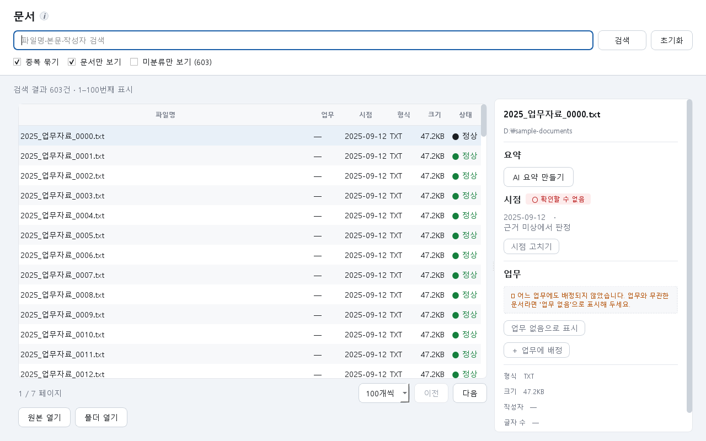

# 보완 작업 결과 보고

> 문서 갱신: **2026-09-15**. 본문 검증 수치는 직전 코드 보완 실행 기록을 유지한다. 후속 문서 현행화에서 [전체 문서 안내](README.md)와 [현재 구현 상태](01_현재구현_및_검증현황.md)를 추가하고 [README 화면](screenshots/README.md)을 다시 촬영했다. 본문 603건 화면은 UI 회귀 검증 당시 기록이다.

## 요약

클로드 분석과 저장소 점검을 대조한 뒤, UI/UX를 먼저 구현하고 데이터 신뢰성·배포 준비를 보완했다. 기존 자료를 탐색하고 AI 상태를 이해하는 과정의 불편을 줄였으며, 원본이 바뀌었는데 이전 분석이 남는 문제를 보완했다.

단계별 계획과 UI/UX 별도 계획은 다음 문서에 있다.

- [단계별 보완 계획](단계별_보완계획_2026-09-15.md)
- [UI/UX 개선 계획](UI_UX_개선계획_2026-09-15.md)

## 1. UI/UX — 우선 완료

| 개선 항목 | 결과 |
|---|---|
| 전체 문서 접근 | 500건에서 잘리던 목록을 페이지 탐색으로 변경. 50·100·200건씩 표시하고 전체 건수·현재 범위·페이지 안내 |
| 검색과 상태 안내 | 파일명·경로·본문 검색을 연결하고, 자료 없음과 검색 결과 없음을 구분. 검색 조건 초기화 제공 |
| 상세 내용 확인 | 목록과 상세 영역의 폭 조절 지원. 새로고침 후 선택 문서와 상세 내용 일치 |
| 설정 응답성 | 화면 설정을 열 때 AI 연결을 기다리던 동작 제거. 시스템 탭에서 별도로 연결 상태 확인 |
| 모델 선택 | 답변·요약 모델과 문서 검색 모델을 프로젝트별로 저장. 검색 모델 변경 시 자료 재준비 안내 |
| 질문 대기·취소 | 경과 시간과 취소 버튼 추가. 취소된 답변의 뒤늦은 표시·기록 방지 |
| 화면 검증 | 밝은/어두운 테마, 큰 글자, 마지막 페이지, 검색 결과 없음 화면을 렌더링해 확인 |

603개의 합성 문서로 마지막 페이지 접근과 검색·선택 동작을 검증했다. 아래 화면은 실제 기관 자료가 아닌 합성 자료로 촬영했다.

[어두운 테마](review_2026-09-15/documents-dark.png) · [검색 결과 없음](review_2026-09-15/documents-empty-light.png)

## 2. 데이터·AI 신뢰성 — 완료

- 원본 수정 시 이전 본문·색인·벡터·AI 제안을 함께 무효화하고 다시 생성한다. 실패하면 변경 전체를 되돌리는 데이터베이스 처리로 중간 상태가 남지 않게 했다.
- 사용자가 확정한 날짜와 업무 연결을 보존한다. 사라졌던 파일이 복귀하면 상태를 복원하고, 공유 폴더 접근 실패를 파일 삭제로 오인하지 않게 했다.
- 본문 분석 규칙 버전을 올려 기존 프로젝트도 재분석되게 했다. 재분석 중 기존 결과를 그대로 신뢰하지 않도록 준비 상태를 갱신한다.
- 선택한 모델만 검색에 사용하고, 모델의 정확한 태그를 확인한다. 다른 버전이 설치됐다는 이유로 준비 완료라고 표시하지 않는다.
- AI 통신은 로컬 주소로 제한하고 환경 프록시·주소 재이동을 사용하지 않는다. 질문 취소 시 진행 중인 요청도 중단한다.
- 숫자를 부분 문자열로 비교하던 검증을 보완했다. 쉼표와 백분율을 구분하고, 한 자리 숫자 및 일부 부정 표현 불일치를 확인한다. 이는 모든 의미 오류를 판별하는 기능은 아니다.
- 생성 도중 자료가 변경되면 이전 자료 기반 답변·요약이 저장되지 않도록 확인한다. 분석·질문·예열 작업의 종료와 재시작 수명을 보완했다.

## 3. 배포·진단·개발 흐름 — 완료

- 실행 파일에 로고를 포함하고, 자체 점검에서 로고·SQL·프롬프트 및 본문 추출 상태를 검사한다.
- 실행 스크립트는 버전 잠금 파일을 기준으로 설치한다. 로컬 패키지 폴더를 통한 오프라인 설치 경로와 실패 안내를 추가했다.
- 진단 로그는 이벤트·오류 종류·코드 위치를 기록하고, 문서 본문·질문·오류 메시지·자료 경로를 기록하지 않도록 제한했다. 로그 크기와 보관 개수를 제한했다.
- GitHub Actions와 GitLab CI 검증 설정을 추가했다. 원격 실행은 아직 하지 않았으며, GitLab은 Windows 실행 장비 설정이 필요하다.
- 테스트 임시 폴더와 화면 객체 정리를 보완했다. README와 제품 기준서의 실제 구현과 다른 설명을 수정했다.

## 4. 검증 결과

최종 소스와 새 배포본으로 검증했다. 실행 시간은 이 개발 PC에서의 기록이며 저사양 장비의 성능 보장은 아니다.

| 검증 | 결과 |
|---|---|
| UI·작업 수명·설정 집중 검사 | 95개 통과 |
| 최종 전체 회귀 테스트 | 902개 통과, 4개 건너뜀, 295.81초. 실패 없음 |
| 실제 설치 모델을 사용하는 별도 검사 | 36개 통과, 42.52초. 임베딩·문서 검색·근거 인용 질문 포함 |
| 최종 Windows 실행 파일 빌드 | 성공 |
| 실행 파일 자체 점검 | 성공. 합성 문서 77개 정상 추출, 7개 확장자 포함 |
| 화면 렌더링·수정 형식 검사 | 통과 |

합성 표본 추출 결과는 CSV 14, DOCX 17, HWPX 1, PDF 5, PPTX 5, TXT 1, XLSX 34건이다. 실제 HWP 표본은 포함되지 않았다. UI 화면은 Qt 위젯 렌더링과 자동 동작 검사 기준이며 실제 사용자 사용성 평가를 대신하지 않는다.

전체 검사에서 실제 AI 3개는 기본 실행 정책에 따라 건너뛰었고 별도 실제 모델 검사에서 통과했다. 외부 표본 회귀 검사 1개는 표본 경로가 설정되지 않아 건너뛰었다. 기존 테스트의 오래된 `QMouseEvent` 호출에 관한 경고 1건이 남아 있다.

[전체 테스트 기록](review_2026-09-15/test-results.txt) · [실제 AI 검사 기록](review_2026-09-15/live-ai-results.txt) · [배포본 자체 점검 기록](review_2026-09-15/selftest-results.txt)

## 5. 실행 방법과 인계

검증용 새 배포본: `dist/review-20260915-final/NunchiCoach/NunchiCoach.exe`

`NunchiCoach` 폴더 전체를 유지해 실행한다. 다른 PC에 복사할 때 실행 파일만 옮기면 안 된다. AI 모델 설치는 별도다. 구성요소 목록은 `dist/review-20260915-final/sbom.cdx.json`에 있다.

**기존 프로젝트를 처음 열면 자료 재분석 시간이 필요할 수 있다.** 검색 모델을 바꾼 경우에도 자료를 다시 준비한다. 사용자 교정 보존은 회귀 테스트로 확인했다.

실행 파일 SHA-256: `B8B5A55186D6B4C32B7AF122FCA2086F185953B6239D78F58754F4C6E4DA523E`

## 6. 남은 후속 작업

문서·화면 후속 갱신에서 합성 평가셋의 답변 대상 두 질문이 유보되는 현상을 추가 관찰했다. [현행 상태의 관찰 기록](01_현재구현_및_검증현황.md#6-문서-현행화-중-추가-관찰)에 따라 원인을 점검해야 한다. 본문의 902/36 통과는 앞선 실행 기록이며 이 추가 질문의 통과를 뜻하지 않는다.

다음 항목은 자료·장비 또는 소유자의 결정이 필요한 후속 검증이다. 세부 절차는 [파일럿 및 배포 검증 계획](파일럿_및_배포_검증계획.md)에 정리했다.

1. 실제 기관 문서와 정답·출처가 확인된 질문으로 품질 평가.
2. 8GB PC에서 첫 질문·연속 질문 지연, 최대 메모리, 취소 시간 측정.
3. 재배포 가능한 실제 HWP 표본으로 본문·표·암호·구버전 회귀 확인.
4. 원격 CI 실행 및 Python 없는 오프라인 PC에서 배포 폴더 실행 확인.
5. 공개 라이선스, 기관 반입·서명·백업 정책 확정.

첨부 분석의 과거 성능 수치를 이번 변경의 실측 성능으로 재사용하지 않았다.
